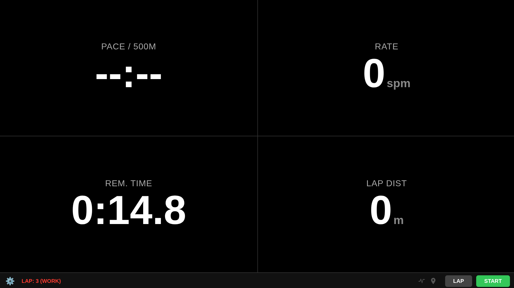

# WebSpeedCoach

WebSpeedCoach is a lightweight mobile web app that turns your phone into a rowing stroke/speed coach.

**How it works**
- Open `main.html` in a modern mobile browser and place the phone on your rowing boat (screen up).
- The app uses the phone's GPS and accelerometer to estimate pace, stroke rate (spm), lap time and distance.
- Use the gear icon to pick Free / Distance / Time interval modes.

**Notes**
- Requires a modern mobile browser with ES module support. Audio playback and device motion may require user interaction and permissions.
- Grant location and motion permissions when prompted. Tap Start to initialize audio and sensors.
- The UI is kept intentionally minimal to be readable while on the water.